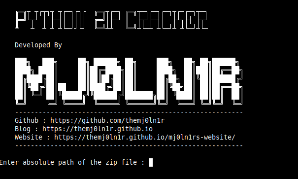

# PythonZipCracker

This is a multiway password protected zip file cracker. The script is developed using python which can perform following tasks.

	1. It can crack the password of a zip file with the rockyou.txt
	2. It can crack the password of a zip file using your own password list
    3. It can crack the password of a zip file with the bruteforcing of digits

### Requirements

You require these additional modules 

	1. pyzipper

These modules will be pre installed on every system, if not then install them with `pip3 or pip`
**You need to download rockyou.txt and paste it in PythonZipCracker folder**
>Rockyou.txt : https://www.kaggle.com/datasets/wjburns/common-password-list-rockyoutxt

### Installation

```text 
git clone https://github.com/TheMj0ln1r/PythonZipCracker.git
cd PythonZipCracker
python3 crack.py
```



> If anything should be modified in the script please let me know.

If you want to learn more about my tool you can find it on my blog.


##### Doveloped by Mj0ln1r
##### Website : https://themj0ln1r.github.io/mj0ln1rs-website/
##### Blog : https://themj0ln1r.github.io
